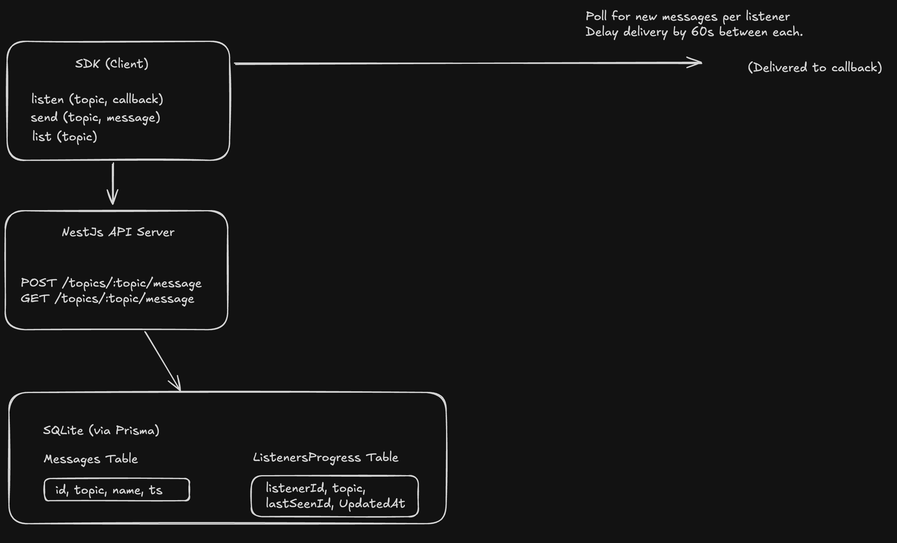

## Architecture and Design Decisions

### Purpose

This API was built to support a horizontally scalable messaging system with the unique constraint that each listener must receive messages spaced 60 seconds apart, while remaining easy to run, test, and understand.

## Horizontal Scalability

The system is built to **scale across multiple API instances** running behind a load balancer. All application state that affects logic—such as message delivery delay—is stored in a **shared database**, not in memory, ensuring consistent behavior regardless of which instance handles a given request.

Key strategies used to support scaling:

- **Stateless API instances** – All application logic depends only on request data and the shared database.
- **Shared progress tracking** – Each listener's progress is tracked using a `ListenerProgress` table in the database.
- **No in-memory assumptions** – Avoids memory-based queues, caches, or timers that break across instances.

### Why Use the Database for Delay Logic?

A critical requirement is that each listener must receive messages **no more than once every 60 seconds**.

Instead of using distributed locks, timers, or an external queueing system, the delay logic is implemented using a **simple timestamp comparison in the database**:

- When a listener requests the next message:

  - We check the `updatedAt` timestamp in the `ListenerProgress` table.
  - If at least 60 seconds have passed, we deliver the next message.
  - We update the `lastSeenId` and `updatedAt`.

This guarantees that **even with multiple API instances**, the constraint is honored without complex coordination or infrastructure.

## Architectural Tradeoffs and Design Decisions

### No External Queues

This project **deliberately avoids using external message queues** like RabbitMQ, Kafka, or Redis Streams. This keeps the implementation self-contained and focuses on the core logic, helping to:

- Showcase how **delay and progress tracking** can be done purely with a relational DB.
- Avoid the overhead of setting up and managing extra services.
- Emphasize conceptual clarity over production-grade throughput.

### SQLite as In-Memory Database

We use **SQLite** with Prisma, kept in-memory or persisted as a local `.db` file.

- This makes it extremely easy to **clone and run** the app without external dependencies.
- For real deployments, a swap to Postgres or MySQL would be straightforward.

### Focus on Integration and E2E Testing

While unit testing has value, this API emphasizes **integration and end-to-end (E2E) tests**, because:

- The interactions between authentication, message timing, and data persistence are **better tested as a whole**.
- E2E tests give more confidence that the system behaves as expected across real-world scenarios.

### Intentional Simplicity over Exhaustive Coverage

This API leaves room for enhancements, such as:

- **Input validation** and strict **DTOs**.
- **Pagination** on message lists.
- **Rate limiting**, logging, and monitoring.

These were omitted to maintain **clarity and simplicity** while still building a strong foundation that can scale horizontally.

### Diagram

This goes to simply illustrate my understanding of the requirements. I decided to draw just the critical piece as opposed of the entire system.

